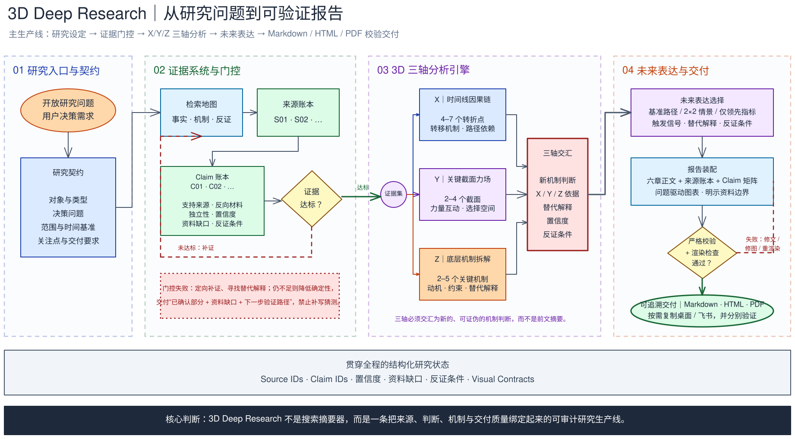

# 3D Deep Research

[简体中文](README.zh-CN.md)

**Evidence-backed deep research for traceable, decision-ready reports.**

3D Deep Research is a single Agent Skill for turning open-ended questions into structured research reports. It combines source and Claim ledgers, counterevidence search, evidence gates, three-dimensional analysis, and validated Markdown, HTML, and PDF delivery.

> From sources to claims. From timeline to mechanisms.



## Why this Skill

Most research workflows stop at search and synthesis. This Skill makes the reasoning path inspectable:

- **Source traceability** — record source type, evidence role, independence, dates, and limitations.
- **Claim traceability** — bind load-bearing judgments to Source IDs, counterevidence, confidence, gaps, and disconfirmation conditions.
- **Evidence gates** — facts, causes, mechanisms, market judgments, and forecasts use different minimum thresholds.
- **Mechanism-level analysis** — connect a timeline, a force field, and internal mechanisms instead of producing a flat summary.
- **Validated delivery** — check structure, citations, rendering, PDF text, and visual integrity before handoff.

## The 3D method

| Dimension | Question | Typical output |
|---|---|---|
| **X — Timeline** | How did the subject arrive here? | 4–7 path-changing turning points |
| **Y — Force field** | Which forces accelerated, constrained, or redirected the path? | 2–4 critical time slices |
| **Z — Mechanisms** | Why did the key actors and systems behave this way? | 2–5 mechanisms with alternatives |

The three dimensions must converge into a new, falsifiable judgment. `3D` here means timeline × forces × mechanisms; this is not a 3D graphics, modeling, rendering, or CAD Skill.

## Workflow

```text
Research question
  → Research contract
  → Search map: facts / causes / counterevidence
  → Source ledger + Claim ledger
  → Evidence gates
  → X/Y/Z analysis and synthesis
  → Baseline path, scenario matrix, or leading indicators
  → Report assembly
  → Strict validation and browser/PDF rendering
  → Markdown / HTML / PDF delivery
```

When evidence is insufficient, the workflow returns a continuing state: confirmed findings, evidence gaps, and a next verification path. It does not fill missing support with plausible-sounding claims.

## Use cases

- Company, product, technology, concept, person, event, and industry research.
- Competitive analysis, due diligence, market and ecosystem research.
- Technology evaluation and policy or regulatory background research.
- Historical path reconstruction and mechanism-level explanation.
- Decision-ready reports with explicit uncertainty and leading indicators.

## Install

The repository is intentionally single-Skill, while the public README remains outside the Skill directory.

### Codex

```bash
git clone https://github.com/Arslan-jh/3d-deep-research.git
cp -R 3d-deep-research/3d-deep-research ~/.codex/skills/3d-deep-research
```

Use `$3d-deep-research` or invoke it naturally with a request for deep research, evidence synthesis, competitive analysis, or a research report.

### Windows PowerShell

```powershell
git clone https://github.com/Arslan-jh/3d-deep-research.git
Copy-Item -Recurse .\3d-deep-research\3d-deep-research $env:USERPROFILE\.codex\skills\3d-deep-research
```

The same `3d-deep-research/` Skill directory can be copied into another Agent Skills-compatible runtime after its local installation path is confirmed.

## Example

- [Representative workflow report](examples/3d-deep-research-workflow/report.md)
- [Rendered HTML report](examples/3d-deep-research-workflow/report.html)
- [Rendered PDF report](examples/3d-deep-research-workflow/report.pdf)
- [Editable workflow diagram](media/3d-deep-research-flow.excalidraw)

Example prompts:

```text
Deep research the competitive position and future risks of a technology company.

Compare two products through their timeline, market forces, and underlying mechanisms.

Build an evidence-backed industry report with counterarguments and leading indicators.
```

## Quality gates

Before delivery, the Skill checks:

1. One H1 and six ordered main sections.
2. Source IDs resolve to a source ledger.
3. A Claim evidence matrix exists.
4. No unresolved template placeholders or unrendered Mermaid remain.
5. HTML/PDF rendering succeeds and PDF text is extractable.
6. Visual outputs are checked for missing glyphs, clipping, overlap, and unreadable density.

Run the repository validators against a report:

```bash
python 3d-deep-research/scripts/validate_report.py report.md --strict
python 3d-deep-research/scripts/render_report.py report.md output.pdf --engine auto
```

## Repository structure

```text
3d-deep-research/
├── README.md
├── README.zh-CN.md
├── LICENSE
├── media/
├── examples/
└── 3d-deep-research/
    ├── SKILL.md
    ├── agents/openai.yaml
    ├── assets/
    ├── references/
    ├── scripts/
    └── schema.json
```

## Boundaries

This Skill provides a research method and delivery workflow. It does not guarantee that every source is correct, replace domain experts, or turn a structural validation pass into proof that an external claim is true. Public-source gaps, conflicting evidence, access failures, and uncertain forecasts remain visible in the report.

## License

MIT. See [LICENSE](LICENSE).
